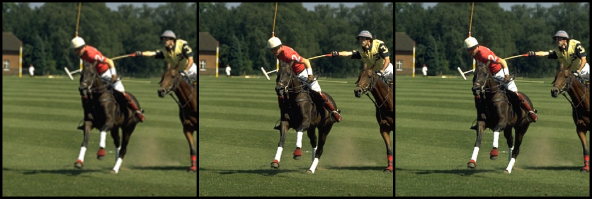
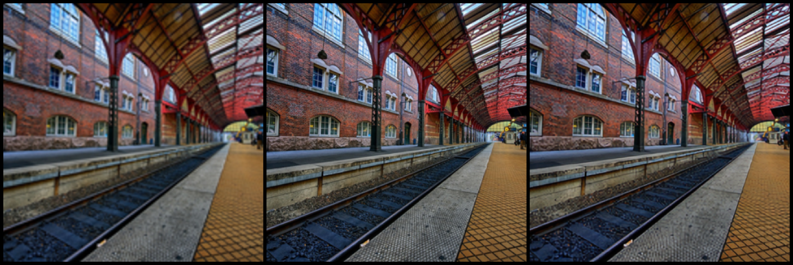
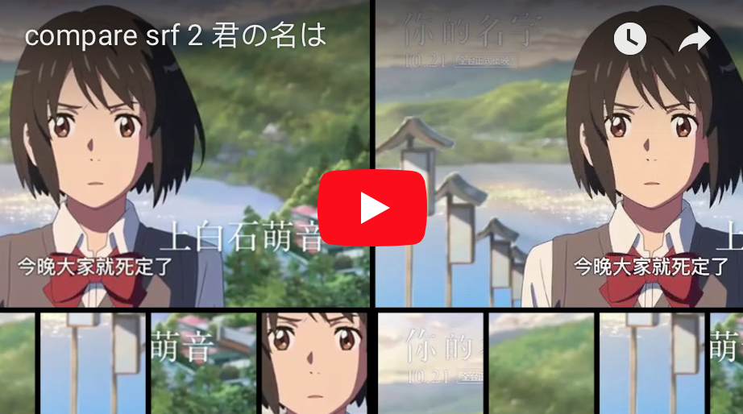
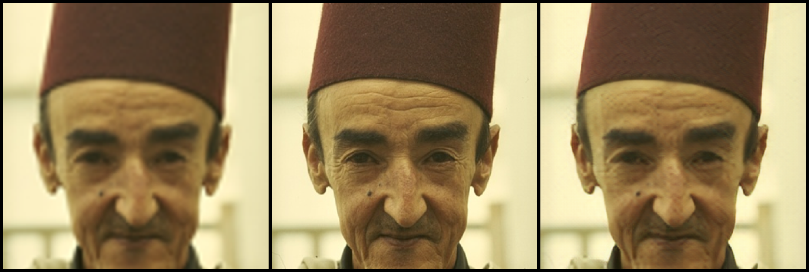
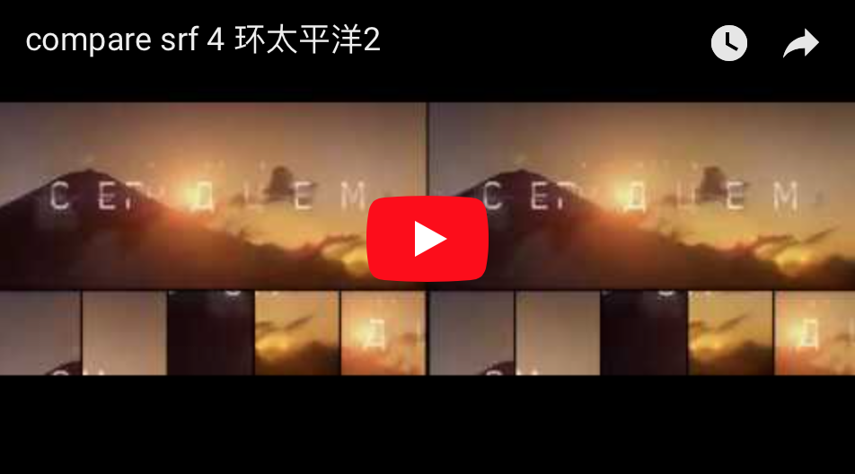
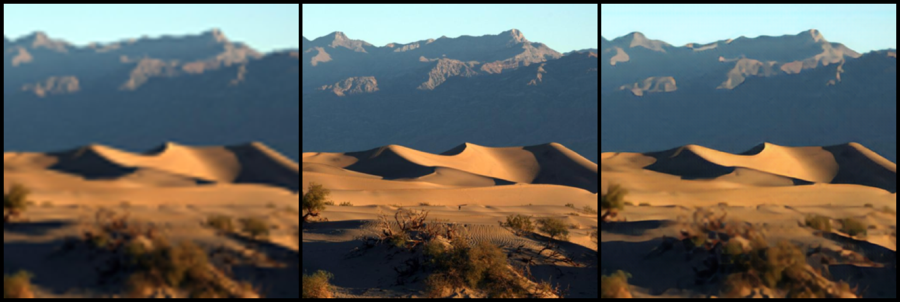
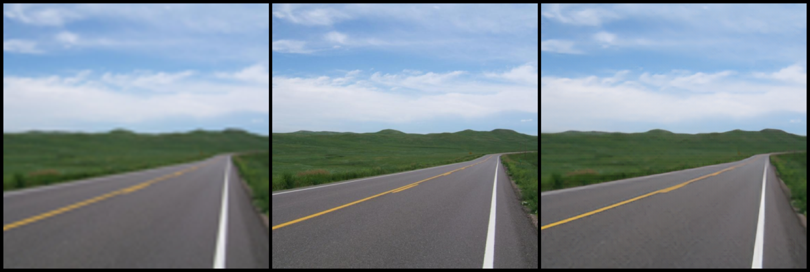
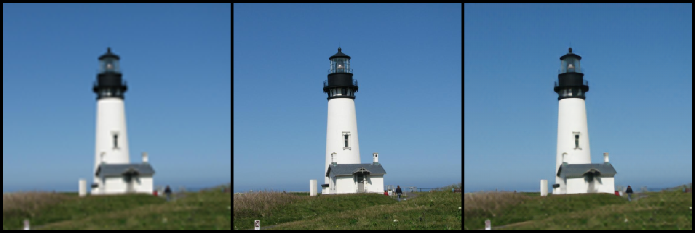
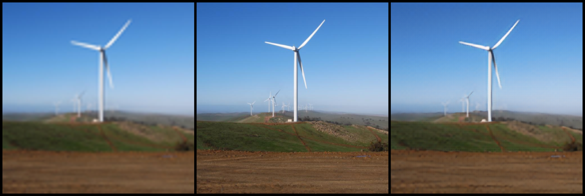
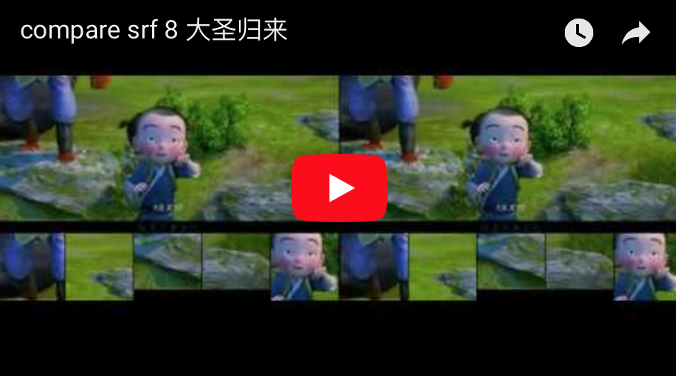

# SRGAN
A PyTorch implementation of SRGAN based on the paper 
[Photo-Realistic Single Image Super-Resolution Using a Generative Adversarial Network](https://arxiv.org/pdf/1609.04802.pdf)

## Requirements
- [Anaconda](https://www.anaconda.com/download/)
- PyTorch
```
conda install pytorch torchvision -c pytorch
```
- tqdm
```
pip install tqdm
```
- opencv
```
conda install -c conda-forge opencv
```

## Datasets

### Train、Val Dataset
The train and val datasets are sampled from [VOC2012](http://cvlab.postech.ac.kr/~mooyeol/pascal_voc_2012/).
Train dataset has 16700 images and Val dataset has 425 images.
Download the datasets from [here](https://pan.baidu.com/s/1c17nfeo), and then extract it into `data` directory.

### Test Image Dataset
The test image dataset are sampled from 
| **Set 5** |  [Bevilacqua et al. BMVC 2012](http://people.rennes.inria.fr/Aline.Roumy/results/SR_BMVC12.html)
| **Set 14** |  [Zeyde et al. LNCS 2010](https://sites.google.com/site/romanzeyde/research-interests)
| **BSD 100** | [Martin et al. ICCV 2001](https://www.eecs.berkeley.edu/Research/Projects/CS/vision/bsds/)
| **Sun-Hays 80** | [Sun and Hays ICCP 2012](http://cs.brown.edu/~lbsun/SRproj2012/SR_iccp2012.html)
| **Urban 100** | [Huang et al. CVPR 2015](https://sites.google.com/site/jbhuang0604/publications/struct_sr).
Download the image dataset from [here](https://pan.baidu.com/s/1nuGyn8l), and then extract it into `data` directory.

### Test Video Dataset
The test video dataset are three trailers. Download the video dataset from 
[here](https://pan.baidu.com/s/1dEHwNnj).

## Usage

### Train
```
python train.py

optional arguments:
--crop_size                   training images crop size [default value is 88]
--upscale_factor              super resolution upscale factor [default value is 4](choices:[2, 4, 8])
--g_trigger_threshold         generator update trigger threshold [default value is 0.2](choices:[0.1, 0.2, 0.3, 0.4, 0.5])
--g_update_number             generator update number [default value is 2](choices:[1, 2, 3, 4, 5])
--num_epochs                  train epoch number [default value is 100]
```
The output val super resolution images are on `training_results` directory.

### Test Benchmark Datasets
```
python test_benchmark.py

optional arguments:
--upscale_factor              super resolution upscale factor [default value is 4]
--model_name                  generator model epoch name [default value is netG_epoch_4_100.pth]
```
The output super resolution images are on `benchmark_results` directory.

### Test Single Image
```
python test_image.py

optional arguments:
--upscale_factor              super resolution upscale factor [default value is 4]
--test_mode                   using GPU or CPU [default value is 'GPU'](choices:['GPU', 'CPU'])
--image_name                  test low resolution image name
--model_name                  generator model epoch name [default value is netG_epoch_4_100.pth]
```
The output super resolution image are on the same directory.

### Test Single Video
```
python test_video.py

optional arguments:
--upscale_factor              super resolution upscale factor [default value is 4]
--video_name                  test low resolution video name
--model_name                  generator model epoch name [default value is netG_epoch_4_100.pth]
```
The output super resolution video and compared video are on the same directory.

## Benchmarks
**Upscale Factor = 2**

Epochs with batch size of 64 takes ~2 minute 30 seconds on a NVIDIA GTX 1080Ti GPU. 

> Image Results

The left is bicubic interpolation image, the middle is high resolution image, and 
the right is super resolution image(output of the SRGAN).

- BSD100_070(PSNR:32.4517; SSIM:0.9191)



- Set14_005(PSNR:26.9171; SSIM:0.9119)


- Set14_013(PSNR:30.8040; SSIM:0.9651)


- Urban100_098(PSNR:24.3765; SSIM:0.7855)



> Video Results

The left is bicubic interpolation video, the right is super resolution video(output of the SRGAN).

[](https://youtu.be/05vx-vOJOZs)

**Upscale Factor = 4**

Epochs with batch size of 64 takes ~4 minute 30 seconds on a NVIDIA GTX 1080Ti GPU. 

> Image Results

The left is bicubic interpolation image, the middle is high resolution image, and 
the right is super resolution image(output of the SRGAN).

- BSD100_035(PSNR:32.3980; SSIM:0.8512)



- Set14_011(PSNR:29.5944; SSIM:0.9044)


- Set14_014(PSNR:25.1299; SSIM:0.7406)


- Urban100_060(PSNR:20.7129; SSIM:0.5263)


> Video Results

The left is bicubic interpolation video, the right is super resolution video(output of the SRGAN).

[](https://youtu.be/tNR2eiMeoQs)

**Upscale Factor = 8**

Epochs with batch size of 64 takes ~3 minute 30 seconds on a NVIDIA GTX 1080Ti GPU. 

> Image Results

The left is bicubic interpolation image, the middle is high resolution image, and 
the right is super resolution image(output of the SRGAN).

- SunHays80_027(PSNR:29.4941; SSIM:0.8082)



- SunHays80_035(PSNR:32.1546; SSIM:0.8449)



- SunHays80_043(PSNR:30.9716; SSIM:0.8789)



- SunHays80_078(PSNR:31.9351; SSIM:0.8381)



> Video Results

The left is bicubic interpolation video, the right is super resolution video(output of the SRGAN).

[](https://youtu.be/EuvXTKCRr8I)

The complete test results could be downloaded from [here](https://pan.baidu.com/s/1qXTRC8c).

